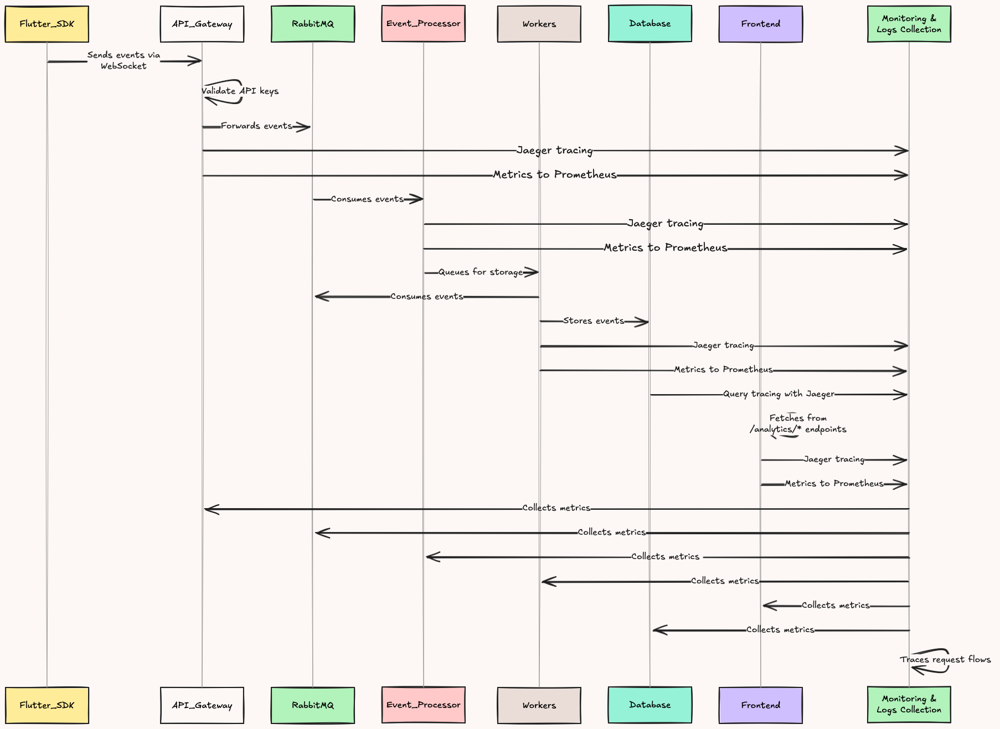

# SmolHog

A lightweight analytics engine with Flutter SDK and backend infrastructure.

## Architecture



## Tech Stack

| Technology         | Purpose                           |
| ------------------ | --------------------------------- |
| Typescript/Express | API Gateway                       |
| Flutter/ Dart      | Flutter SDK                       |
| Python/ FastAPI    | Event Processor                   |
| PostgreSQL         | Database                          |
| RabbitMQ           | Message Broker                    |
| NextJS             | Analytics Dashboard (Client Side) |
| Jaeger             | Tracing                           |
| Prometheus         | Monitoring                        |
| Grafana & Loki     | Dashboard & Logs (System Infra)   |
| Docker             | Containerization                  |

### Flutter SDK (`smolhog_flutter/`)
- **Purpose**: Client-side analytics tracking for Flutter apps
- **Features**: User identification, session management, event queueing
- **Key Components**:
  - [`SmolHog`](smolhog_flutter/lib/smolhog/smolhog.dart) - Main analytics class with singleton pattern
  - Persistent user ID storage using SharedPreferences
  - Session tracking with generated IDs

### Backend Services

#### API Gateway (`infra/backend/api-gateway/`)
- **Tech**: Express.js with TypeScript
- **Purpose**: Main entry point for analytics events
- **Features**: CORS-enabled, JSON request handling

#### Event Processor (`infra/backend/event-processor/`)
- **Tech**: Python
- **Purpose**: Process and transform incoming analytics events

#### Workers (`infra/backend/workers/`)
- **Tech**: Python
- **Purpose**: Background job processing

### Frontend (`infra/frontend/`)
- **Tech**: Next.js with TypeScript and Tailwind CSS
- **Purpose**: Analytics dashboard and management interface
- **Features**: API proxy configuration, animated landing page

### Database (`migrations/`)
- **Tech**: PostgreSQL
- **Purpose**: Store analytics data and events

## Getting Started

### Flutter SDK
```dart
import 'package:smolhog_flutter/smolhog_flutter.dart';

await SmolHog.initialize(
  apiKey: 'your-api-key',
  host: 'your-host-url',
);
```

### Run Locally

```bash
make up
make migrate-up
```
then run `main.dart` at [*smolhog_flutter/example/lib/main.dart*](smolhog_flutter/example/lib/main.dart)
## Development

- **Flutter SDK**: Standard Dart/Flutter development
- **Backend**: Node.js (Bun) and Python services
- **Frontend**: Next.js with hot reload
- **Database**: PostgreSQL